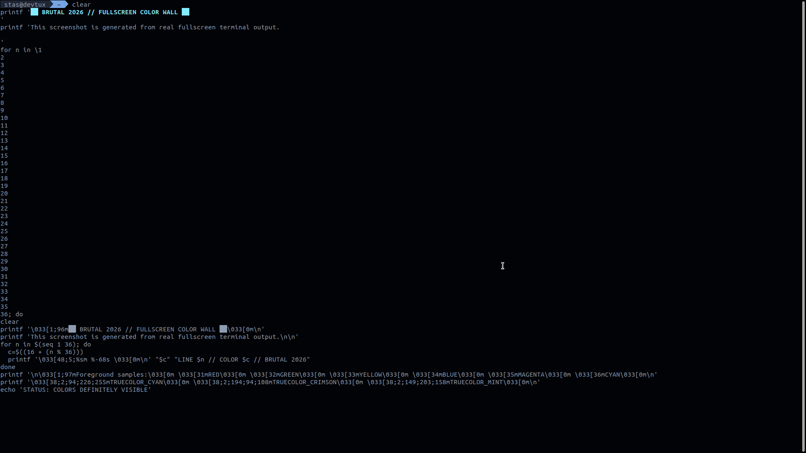

# BRUTAL 2026 Terminal Style (Ubuntu)

Жесткий темный стиль терминала для Ubuntu: фон почти черный, стальной текст, холодный курсор, кастомный скроллбар, единый вид для `bash/zsh`, `gnome-terminal` и `konsole`.



## Что настраивается

- Глобальная тема терминала через OSC-коды для интерактивных shell-сессий.
- Автоподключение темы в `~/.zshrc` и `~/.bashrc`.
- Профиль `gnome-terminal` (`BRUTAL 2026`) через `gsettings`.
- Профиль `konsole` (`Brutal2026`) и цветовая схема.
- Тёмный стиль скроллбара терминала через GTK CSS (`gtk-3.0`/`gtk-4.0`).

## Быстрая установка

```bash
chmod +x install.sh
./install.sh
```

## Откат

```bash
chmod +x scripts/uninstall.sh
./scripts/uninstall.sh
```

## Примечания

- Для полного применения GTK-скроллбара откройте новое окно терминала.
- На системах без `gnome-terminal` шаг `gsettings` будет пропущен автоматически.
- Для отключения автоприменения в текущей сессии можно выставить:

```bash
export BRUTAL_2026_DISABLED=1
```
